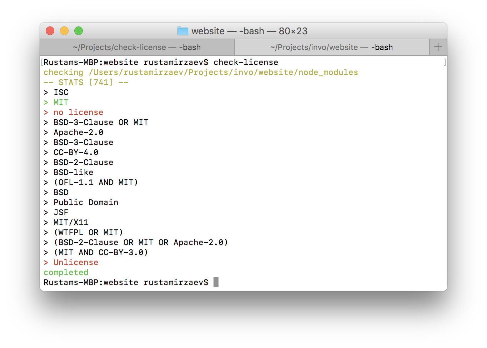
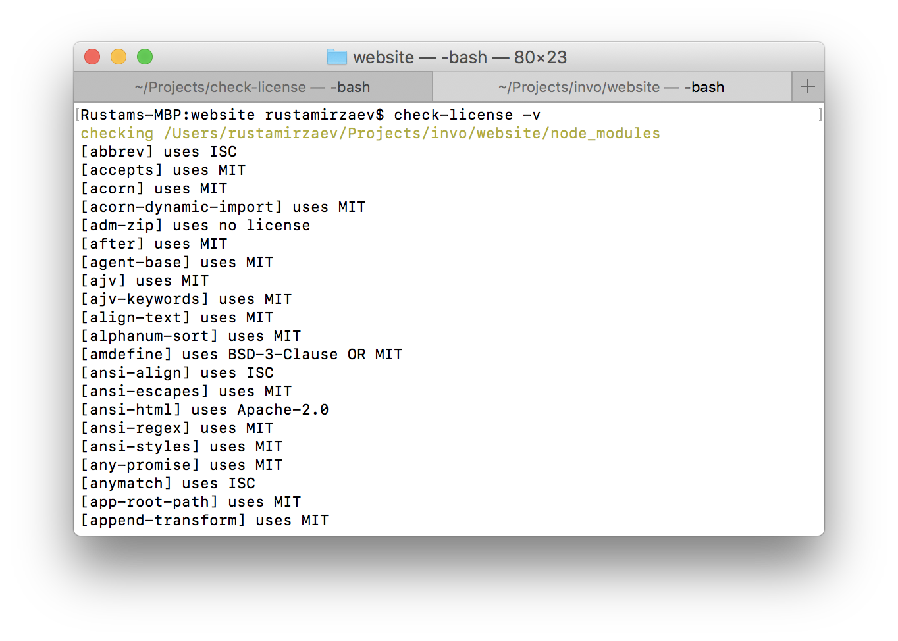

# check-license

Just do a license check of your packages.

## Installation

Install it globally : `npm install check-license -g`

## Usage

Do `check-license` from your project folder.

Additional commands:

* -v    - verbose mode (prints every module with license type)
* -s    - print statistics

## Contributing

I'm still waiting for PRs 🐈

## License

Under MIT license.

## More screenshots

**Verbose mode**

